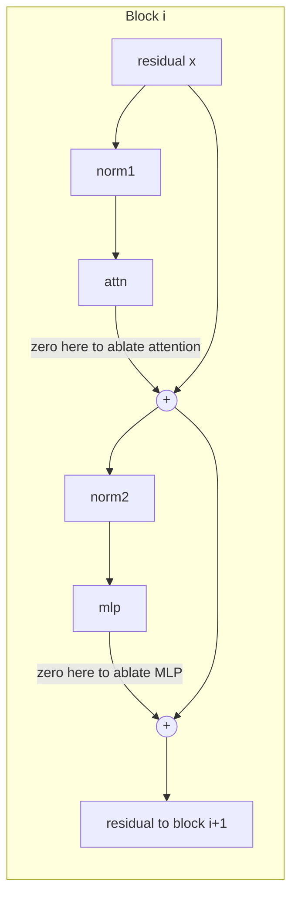

# vit-sae-analysis

A mechanistic study of how position encodings shape spatial structure inside
pretrained Vision Transformers, and a new layer windowed ablation experiment that
localizes where that structure is built and where it decays.

This repository is a more causal, SAE flavored take on the ideas in Mannes,
*Positional Encodings Anchor Spatial Structure in Vision Transformers: A
Geometric Perspective on Robustness* (arXiv 2606.00124). That paper is used only
as guidance. The runs here use two off the shelf pretrained ViT-Base models
rather than the from scratch ViT-S setup in the paper, and the ablation study
below is our own.

## Models and data

| Role | Model | Position encoding | Source |
| --- | --- | --- | --- |
| APE | `google/vit-base-patch16-224` | learned absolute | transformers |
| RoPE | `vit_base_patch16_rope_224.naver_in1k` | rotary | timm |

Both are ViT-Base/16 at 224 resolution with 12 blocks, trained on ImageNet-1k, so
their heads output ImageNet-1k logits directly. The dataset is the ImageNet-1k
validation split, streamed from the Hugging Face Hub. Streaming is why the
`Data` class in `project_code/src/main/prep_data.py` is an `IterableDataset`.

## Core ideas

**SSDC (Spatial Similarity Distance Correlation).** For a layer, take the token
representations, build the token by token cosine similarity matrix `S`, build the
spatial distance matrix `D` from the tokens' grid coordinates (L1 distance), and
report the Spearman rank correlation between similarity and negative distance
over all token pairs:

```
SSDC = spearman( { S_ij }_{i<j}, { -D_ij }_{i<j} )
```

High SSDC means spatially near tokens are represented similarly.

**RPI (Random Permutation at Inference).** Shuffle the patch tokens before the
transformer while pinning the positional signal to the sequence index. Content
driven structure is destroyed by the shuffle. Structure anchored to token index
survives. SSDC under RPI is therefore a probe of index anchored spatial
organization. See `project_code/src/main/model.py` for the permutation hook.

**Fragility.** `fragility = 1 - shifted_accuracy / baseline_accuracy` under a
distribution shift. Here the shift is ImageNet-C Gaussian blur at severity 5.
Higher fragility means more sensitive to the shift.

## Reference results

These are the numbers from the original run that this code reproduces. They live
in `results/reference/` as JSON. Rerunning the notebook regenerates them, with
small variation from image sampling.

**SSDC under RPI across the 12 blocks.**

| Model | Behavior | Peak block | Peak SSDC | Final SSDC |
| --- | --- | --- | --- | --- |
| APE | peaks early then decays | 2 to 3 | 0.66 | 0.13 |
| RoPE | accumulates gradually | 5 | 0.39 | 0.23 |

The APE model builds index anchored structure fast and loses it over the later
blocks. The RoPE model injects position multiplicatively inside attention, so its
recovery accumulates with depth and peaks later.

**Robustness under Gaussian blur (severity 5).**

| Model | Baseline acc | Shifted acc | Fragility |
| --- | --- | --- | --- |
| APE | 0.802 | 0.541 | 0.326 |
| RoPE | 0.836 | 0.586 | 0.299 |

RoPE is the more robust of the two.

## The new experiment: layer windowed ablation

Two working claims motivate this study:

1. Ablating MLPs destroys SSDC recovery under RPI.
2. Ablating attention destroys the SSDC decay that happens in later layers.

Both are stated for whole model ablations. We tighten them by zero ablating a
component only inside an early, middle, or late window, and by the reverse
"keep only" probe that leaves a component alive in a single window. A ViT block
computes `x = x + attn(norm1(x))` then `x = x + mlp(norm2(x))`. Zero ablating a
sublayer forces its output to zero so the residual passes through untouched.
Ablating at block `i` changes the residual from block `i` onward, so the effect
shows up at block `i+1` and beyond. Implementation is in
`project_code/src/interventions/ablation.py` and works for both the transformers
and timm layouts.



The point is to separate two explanations for the APE model's early SSDC peak.

- **Early layers are special.** The early MLP blocks specifically build the index
  anchored structure.
- **First blocks encountered.** Any first surviving MLP blocks would build it,
  wherever they sit in the stack.

Conditions (windows are early `[0,1,2,3]`, mid `[4,5,6,7]`, late `[8,9,10,11]`):

| Condition | What it tests |
| --- | --- |
| `mlp_zero_all` | does removing every MLP crush SSDC recovery under RPI |
| `mlp_zero_early` vs `mlp_zero_late` | is the early peak tied to the early MLPs |
| `mlp_keep_early` / `mlp_keep_mid` / `mlp_keep_late` | does the peak follow the first surviving MLPs (first blocks encountered) |
| `attn_zero_all` | does removing every attention flatten the later layer decay |
| `attn_zero_late` | does removing attention only late still flatten the decay |
| `attn_zero_early` / `attn_zero_mid` | where does attention shape the peak |

How to read the output (the script prints a per condition table of peak,
peak_layer, delta, decay, final, auc):

- If `mlp_zero_all` sends SSDC under RPI toward zero everywhere, MLPs carry the
  index anchored recovery.
- If `mlp_zero_early` removes the early peak but `mlp_zero_late` leaves it, the
  peak is an early MLP phenomenon.
- If `mlp_keep_mid` or `mlp_keep_late` shift the peak to follow the kept window,
  the peak tracks the first surviving MLPs rather than absolute depth.
- If `attn_zero_late` alone flattens the decay, the later layer decay is an
  attention driven, late block effect.

## Extensions

**Effective rank and rank collapse.** Dong et al. (2021) show that attention
without MLPs and skip connections drives token representations toward rank one
with depth. `project_code/src/metrics/effective_rank.py` measures effective rank
across the residual stream, and `effective_rank_probe.py` compares baseline,
`mlp_zero_all`, and `attn_zero_all`. If MLP ablation collapses effective rank
where it also collapses SSDC recovery, a representational capacity failure and the
spatial structure failure line up, which is a mechanistic account rather than a
correlation.

**Patch shuffle corruption.** `interventions/corruptions.py` adds a grid patch
shuffle shift. It scrambles where local content sits while keeping the global
palette, so it is an input level analogue of RPI and an extra probe of reliance
on local content.

## Repository layout

```
project_code/src/
  main/
    load_models.py      load APE (transformers) and RoPE (timm) with one interface
    prep_data.py        streaming IterableDataset, lazy ImageNet-C or light corruptions
    model.py            predict(), plus the RPI permutation and PE scaling hooks
    make_imagenet_c.py  full ImageNet-C corruption suite (heavy deps, optional)
  metrics/
    ssdc.py             SSDC metric and per layer evaluator
    effective_rank.py   effective rank metric and evaluator (extension)
    robustness.py       fragility score
  interventions/
    ablation.py         AblationController: windowed MLP or attention ablation
    corruptions.py      light Gaussian blur, JPEG, pixelate, patch shuffle
  experiments/
    common.py           dataset streaming, curve summaries, plotting
    reproduce_ssdc.py   SSDC and SSDC under RPI for both models
    reproduce_robustness.py   fragility under Gaussian blur
    ablation_layerwise.py     the new windowed ablation experiment
    effective_rank_probe.py   effective rank under ablation (extension)
  SAE/
    train_SAE.py, resample.py   sparse autoencoder scaffolding (the SAE side)
notebooks/
  vit_ssdc_ablation_colab.ipynb   end to end, runnable on Colab
results/
  reference/          the original run numbers, as JSON
  figures/            output figures land here
docs/
  METHODS.md          metric and intervention details
  EXPERIMENTS.md      the ablation design, hypotheses, and future work
tests/
  test_core.py        unit tests for the metric and ablation logic
```

## Running it

The fastest path is the Colab notebook `notebooks/vit_ssdc_ablation_colab.ipynb`.
It installs dependencies, clones this repo, asks for a Hugging Face token (the
ImageNet-1k split is gated), streams the data, and runs every experiment with
plots.

From the command line:

```bash
pip install -r requirements.txt
export HF_TOKEN=...   # read access to ILSVRC/imagenet-1k
cd project_code/src

python experiments/reproduce_ssdc.py --model both --plot --number-images 1000
python experiments/reproduce_robustness.py --model both --number-images 1000
python experiments/ablation_layerwise.py --model ape --number-images 512 --plot
python experiments/effective_rank_probe.py --model ape --plot
```

Run the unit tests (no GPU, no ImageNet, no weights needed):

```bash
python tests/test_core.py
```

## Notes on scope

The code in this repository is written and unit tested. The full model runs need
a GPU and the gated ImageNet-1k stream, so they are meant to be run in the Colab
notebook. The reference numbers in `results/reference/` are from the original run
and are what the code reproduces. The ablated (trained without PE) and RPT
conditions from the guidance paper require training from scratch and are out of
scope for this pretrained model study.

## References

- Mannes. Positional Encodings Anchor Spatial Structure in Vision Transformers.
  arXiv 2606.00124.
- Dosovitskiy et al. An Image is Worth 16x16 Words. ICLR 2021.
- Heo et al. Rotary Position Embedding for Vision Transformer. ECCV 2024.
- Dong, Cordonnier, Loukas. Attention is not all you need: pure attention loses
  rank doubly exponentially with depth. ICML 2021.
- Hendrycks, Dietterich. Benchmarking Neural Network Robustness to Common
  Corruptions and Perturbations. ICLR 2019.
- Roy, Vetterli. The effective rank: a measure of effective dimensionality. 2007.
