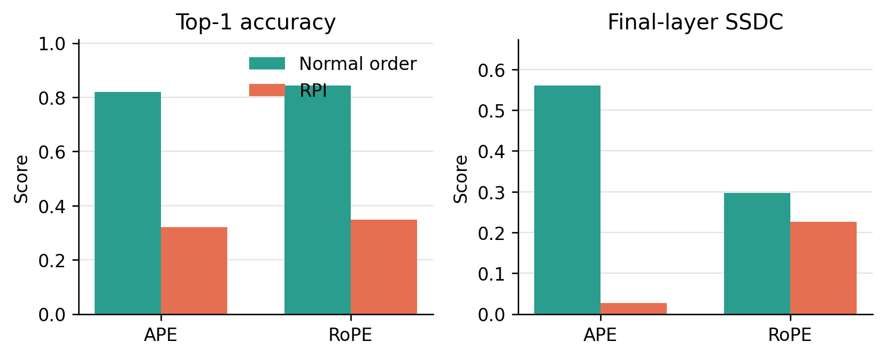
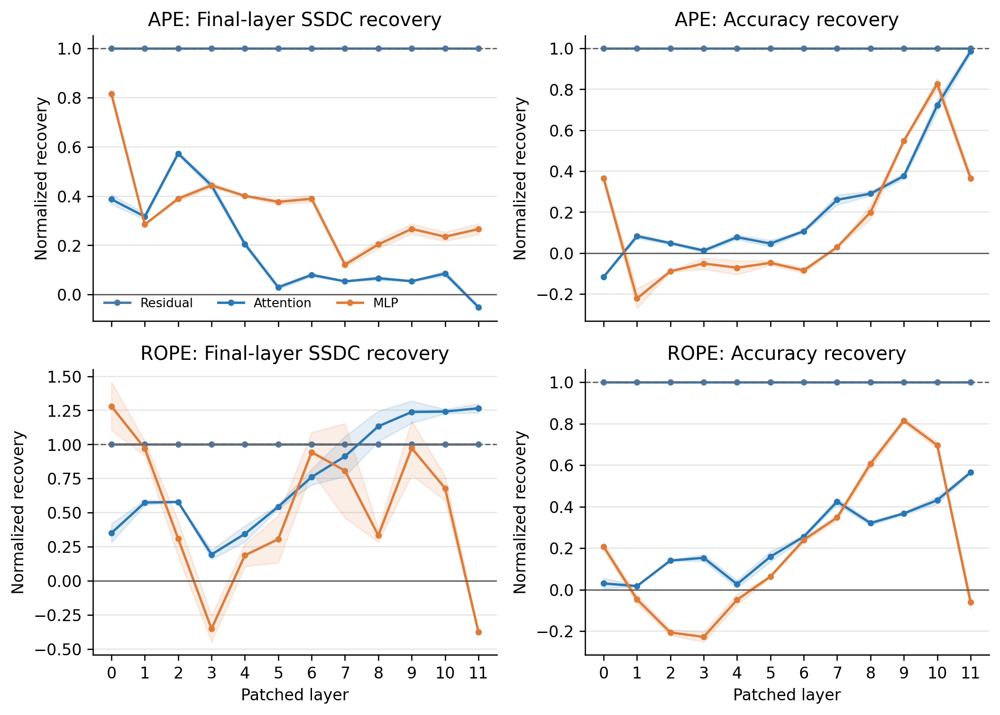
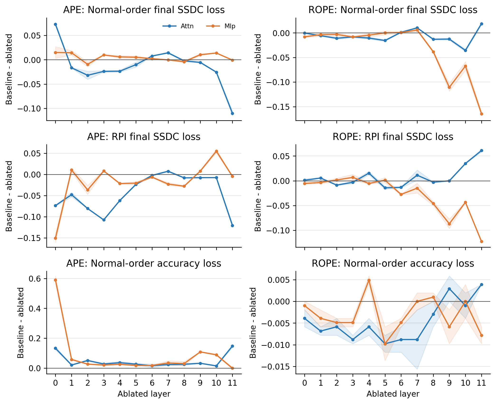
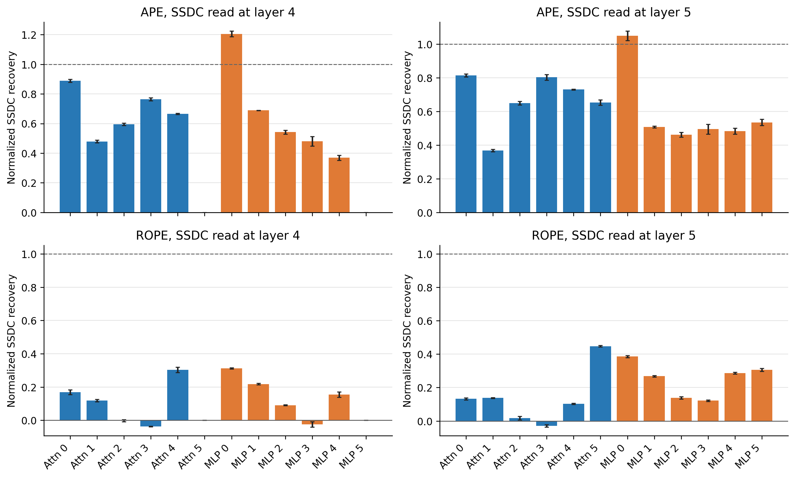
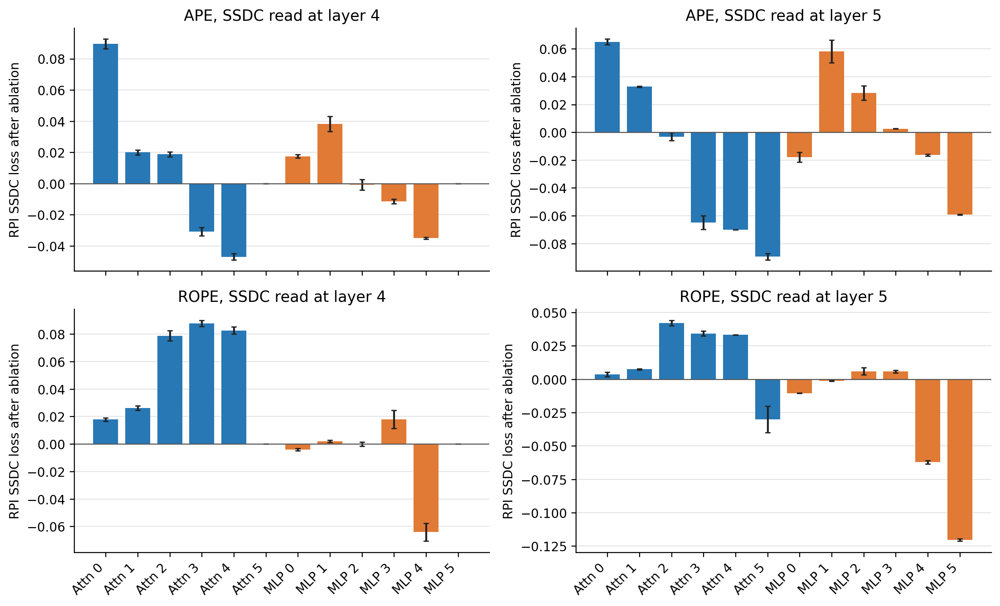
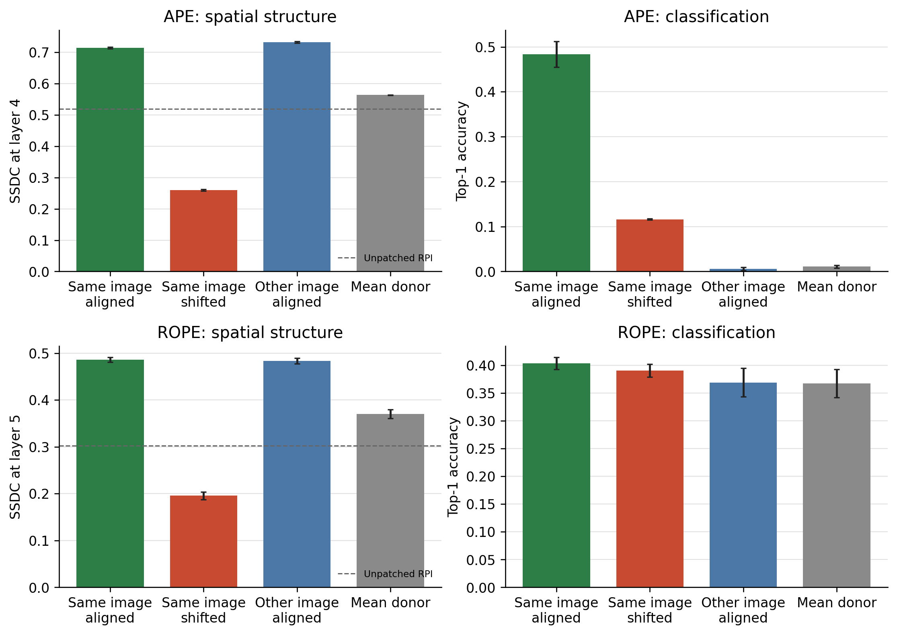
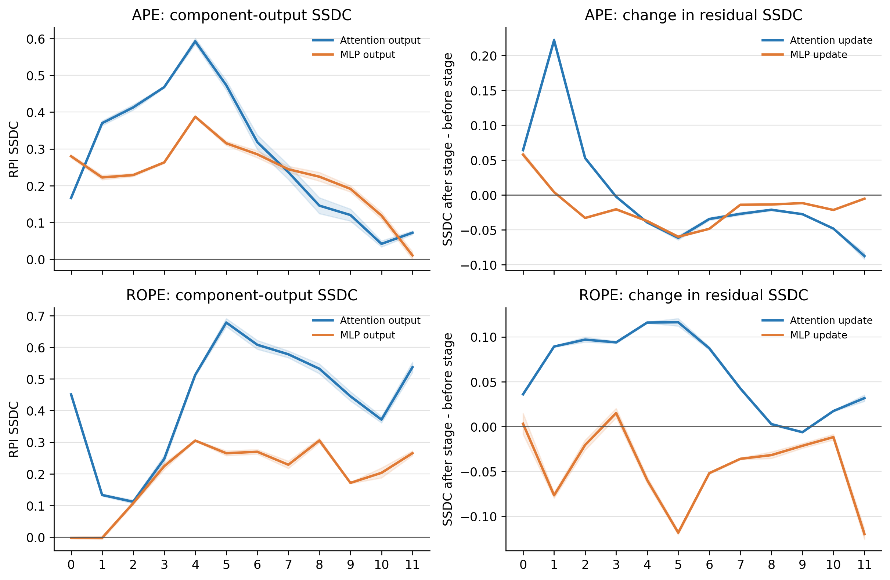
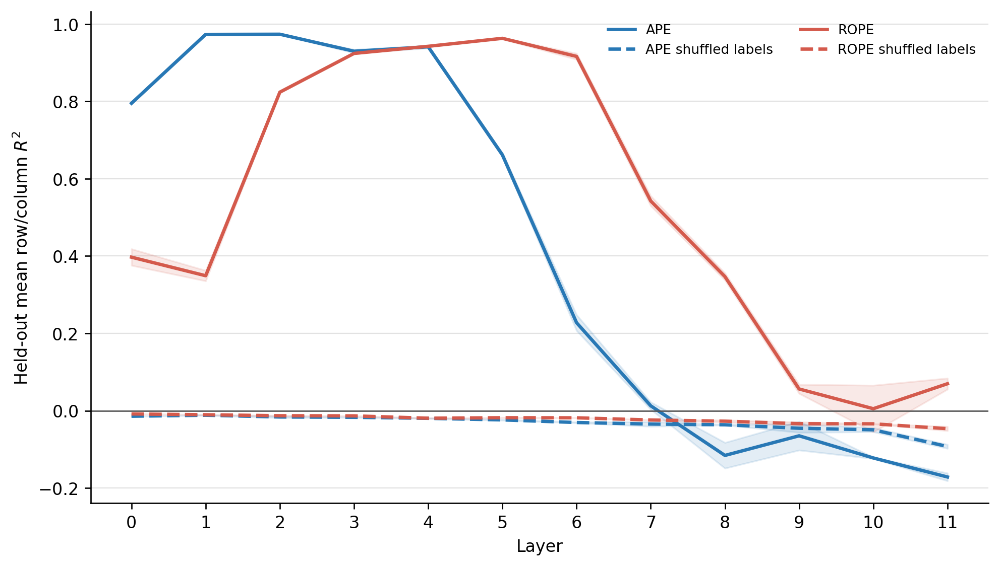

# Causal position follow-up results

These results extend the original SSDC and robustness study with causal
interventions and explicit position readouts. Every condition was repeated with
two image-order and RPI seeds. The curated run files are stored in
[`results/runs/imagenet1k_val/causal_followups/`](../results/runs/imagenet1k_val/causal_followups/),
with exact provenance in its `manifest.json`.

## Main findings

- APE spatial structure is strongly controlled by early computation. Early
  components restore peak-layer SSDC, while later components are more important
  for classification recovery.
- RoPE spatial structure is built mainly through attention across several early
  and middle layers. Attention layers 2-4 are causally required at the SSDC
  peak without reducing clean accuracy.
- Correct token alignment matters much more than donor image identity. This
  separates spatial rescue from simply copying clean image content.
- Row and column coordinates are linearly accessible in attention outputs. APE
  exposes them earlier; RoPE peaks later and across a broader middle-layer band.

## 1. Final-layer localization

Random permutation produced a strong intervention: APE accuracy fell from
**0.820 to 0.320**, and RoPE accuracy fell from **0.844 to 0.348**. Final-layer
SSDC fell from **0.561 to 0.027** in APE and from **0.296 to 0.226** in RoPE.

Patching clean components into the RPI run separated spatial and classification
pathways:

- APE layer-0 MLP restored **0.80/0.83** of the lost final-layer SSDC across the
  two runs.
- APE attention layers 2 and 3 also produced repeatable SSDC recovery.
- Late APE and RoPE components produced the strongest accuracy recovery.
- Full residual-stream patches restored both clean SSDC and accuracy from every
  layer, confirming that the intervention can rescue the model but does not by
  itself localize one special residual layer.

Independent zero ablations supplied the complementary necessity test. APE
layer-0 MLP was essential for classification, but removing it increased RPI
SSDC. No single RoPE component reduced clean accuracy by more than 0.006, while
layer-11 attention produced the clearest final-layer RPI SSDC loss.

## 2. Peak-layer localization

Reading SSDC at layers 4 and 5 produced a clearer causal result than reading
only the final layer.

For APE, layer-0 MLP patching restored **1.21** of the clean-RPI gap at layer 4
and **1.05** at layer 5. Layer-0 and layer-3 attention also recovered most of
the lost structure. For RoPE, recovery was weaker and spread across several
components.

The strongest APE necessity result was attention layer 0, with SSDC losses of
**0.090 at layer 4** and **0.065 at layer 5**. RoPE attention layers 2, 3, and 4
reduced layer-4 SSDC by **0.079, 0.088, and 0.083**. The matched RoPE MLP effects
were generally small or negative, and clean accuracy changed by less than 0.5
percentage points.

## 3. Position-alignment controls

The strongest APE and RoPE patching targets were repeated with four donors:
same-image aligned, same-image token-shifted, different-image aligned, and the
batch-mean donor.

- APE layer-0 MLP SSDC was **0.715** with the aligned donor, **0.260** after
  shifting donor token positions, and **0.732** with an aligned donor from a
  different image.
- RoPE layer-5 attention SSDC was **0.486** aligned, **0.196** shifted, and
  **0.484** with a different-image aligned donor.
- The different-image APE donor restored SSDC but reduced accuracy to **0.006**.

The spatial rescue therefore depends on correct patch position and is largely
independent of donor image identity. It cannot be explained only by copying
clean image content.

## 4. Attention outputs and coordinate probes

Attention and MLP outputs were measured directly, along with their change to
the residual-stream SSDC.

- APE attention increased residual SSDC mainly in layers 0-2. Raw attention
  SSDC peaked at **0.592 at layer 4** and fell to **0.072 at layer 11**.
- RoPE attention increased residual SSDC across layers 0-7. Raw attention SSDC
  reached **0.678 at layer 5** and remained **0.537 at layer 11**.
- RoPE MLP updates usually reduced SSDC, with the largest decrease at layer 5.

Held-out ridge probes then predicted normalized row and column coordinates from
attention outputs under RPI. Images were split before token expansion, probe
evaluation used a new RPI permutation, and shuffled labels supplied a negative
control.

- APE mean row/column test R-squared peaked at **0.974 at layer 2**.
- RoPE peaked later at **0.963 at layer 5** and stayed above 0.90 through layer
  6.
- Probe performance fell sharply in later layers, while late RoPE attention
  retained substantial SSDC. Late spatial structure is therefore not equivalent
  to a simple linearly accessible coordinate code.

## Interpretation and limits

Together, the experiments support a causal model in which APE exposes spatial
structure early, while RoPE constructs it repeatedly through attention across
early and middle layers. Activation patching establishes sufficiency, zero
ablation establishes necessity, and donor controls show that the rescue depends
on token alignment rather than donor content alone.

The main limits are unchanged: full-component interventions are not pure
position interventions, zero is outside the normal activation distribution,
and two seeds do not provide narrow confidence intervals. Feature-level SAE
interventions remain necessary to isolate the specific positional directions.

All runs used the official ImageNet-1k validation split on one NVIDIA RTX A4000
with 16 GB VRAM. Final-layer, peak-layer, and donor-control runs used 512 images
per seed. Attention-output and coordinate-probe runs used 256 images per seed.
